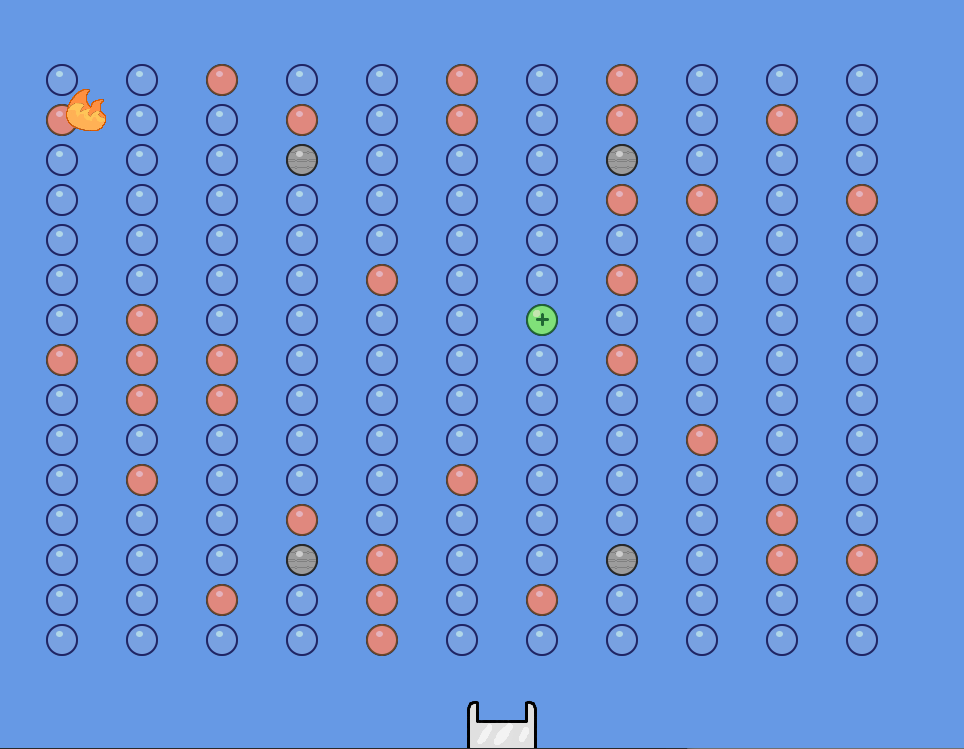

# shadow-bounce-game
A practice of Java to build an interactive game using Object Oriented concept.

## Library
In this project, I will use a library created by my suject coodinator Elanor McMurty, called Bagel.

You will need to import `bagel.jar` to play the game. [Bagel Library](https://people.eng.unimelb.edu.au/mcmurtrye/bagel-doc/)

## Shadow Bounce game:
### This game consists of these following components:
#### Ball: Object that will be controlled by player.
  * Standard ball: destroys pegs upon touch.
  * Fire ball: destroy pegs upon touch, as well as its surrounding pegs (within 70 pixels).
#### Pegs: Has different colors. Each color has a different effect when touched.
  * Grey: Indestructible. Just there to block your way.
  * Blue: Standard color. Disappears upon contact with ball.
  * Red: Acts like Blue, but destroying it is compulsory to pass the level.
  * Green: Randomly transformed from a Blue after each turn. Pops up 2 more ball of the same type to both sides when touched.
#### Other:
  * Fire: Appears every 1 out of 10 turns. Turns a standard ball into a fireball upon touch.
  * Bucket: Add a life for each ball that lands on it.
  
### Game setting

#### Initial
* The game levels will be generated using `.csv` files, and will initially consists of the generated pegs. A fifth of the Blues will turn Red.
* You will have 20 lives at the start of the game.

#### Gameplay
* Choose a position on the screen. Click on the screen, and the ball will launch from the middle top of the screen (512,32) with its initial velocity pointing towards the clicked position (gravity applies).
* Ball will bounce off the pegs upon touch.
* A life is lost when ball is off-screen from the bottom.
* You can aim the ball tot he bucket for extra lives.
* A fire ball will give you abosulte advantages as it will destroy everything within 70 pixels so take your chance
* The combanaiton of fire ball and green ball is savage.
* Goal is to clear all the Reds and advance to the next level until clearing them all.
#### Final version of this game: 

## Note: 
This project is a university assignment from Object Oriented Softwara Development subject in The University of Melbourne, Department of Computing and Software System, Semester 2 2019.

